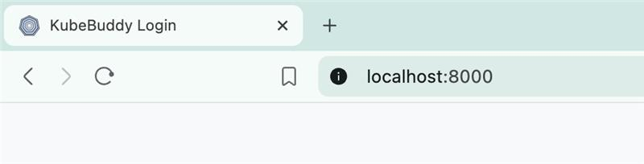
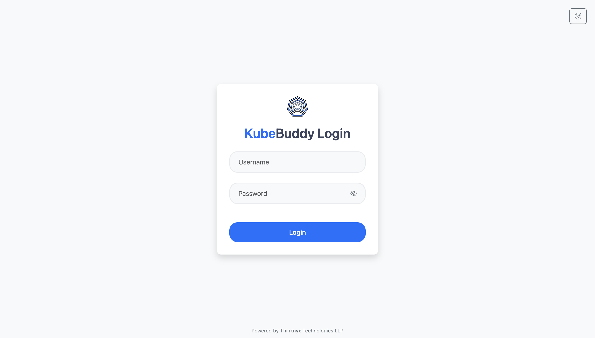
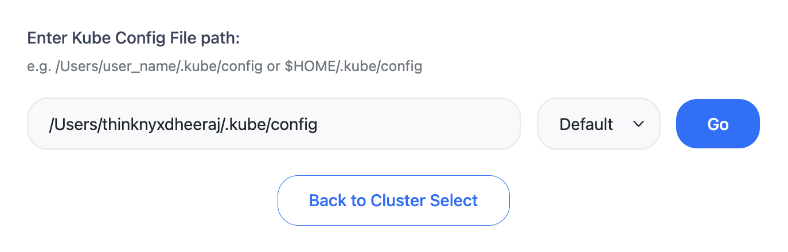
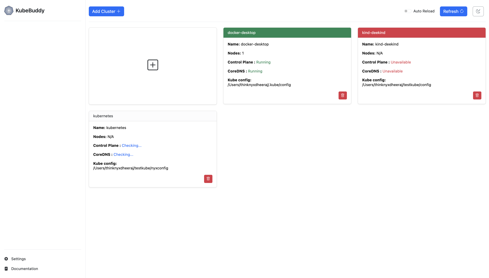
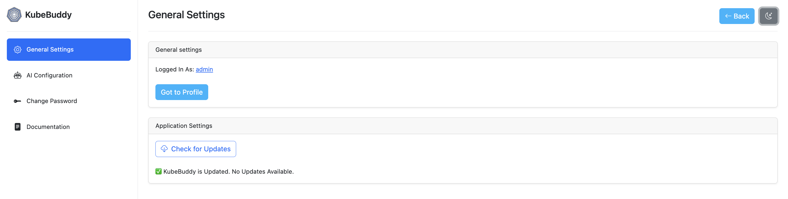
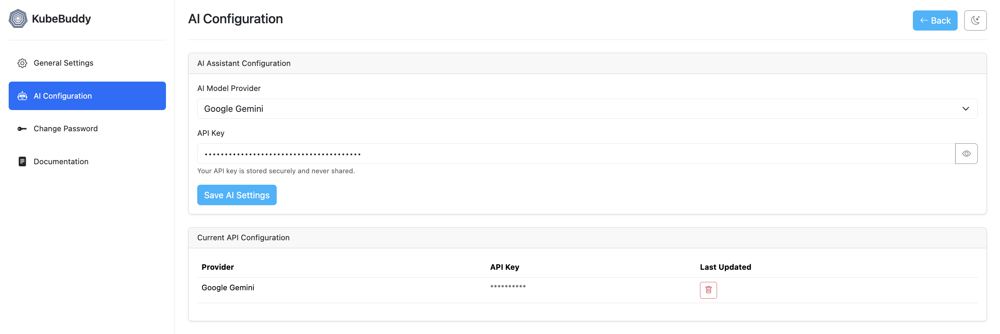
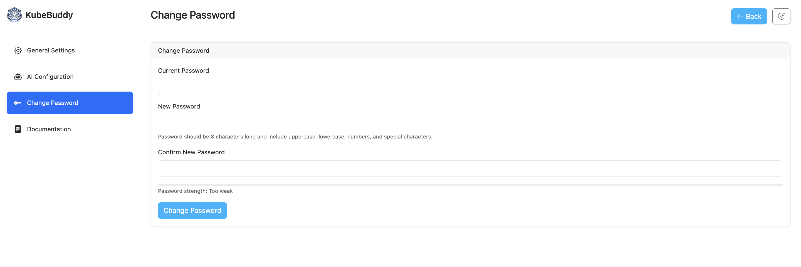
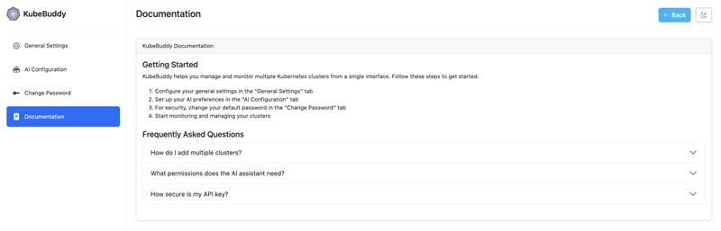

# Getting Started with KubeBuddy

## 1. Access the Application
KubeBuddy runs on any host machine with access to your Kubernetes cluster and allows multiple users to connect via `http://localhost:8000` using a supported browser.

---

## 2. Login
The first user will be redirected to the Login page, where they can sign in using the default credentials:

- **User:** `admin`
- **Password:** `admin` (or the credentials set during setup)

🔒 *For security, we strongly recommend changing your password after the first login.*

---

## 3. Provide Kubeconfig File
You will be prompted to enter the path to your `kubeconfig` file. You can either use the default path or manually enter a custom path. You can provide multiple config files to monitor multiple clusters. Once set, you’ll be redirected to the Cluster Selection page.

---

## 4. Select a Cluster
On the Cluster Selection page, you will see all clusters available in your `kubeconfig` file(s).

- You can add another `kubeconfig` file using the **Add Cluster** button.
- Each cluster card displays its status and can be clicked to access the cluster.
- An **Auto-Reload** feature is available on this page. If toggled on, the page will automatically reload every 30 seconds to reflect the latest cluster status.

---

## 5. Accessing Settings
Click the Settings button in the bottom-left corner to customize your KubeBuddy experience. The Settings page includes the following options:

- **User Information** – View details about your account.

  

- **Buddy AI Configuration** – Integrate Buddy AI by providing your API key. This enables AI-powered assistance for troubleshooting and insights.

  

- **Change Password** – Secure your account by updating your password anytime.

  

- **Documentation** – Access helpful guides, FAQs, and resources to make the most of KubeBuddy.

  

<a href="#architecture">
  <button class="btn btn-secondary btn-sm"> << Previous: Architecture </button>
</a>

<a href="#configuration">
  <button class="btn btn-primary btn-sm">Next: Configuration >> </button>
</a>