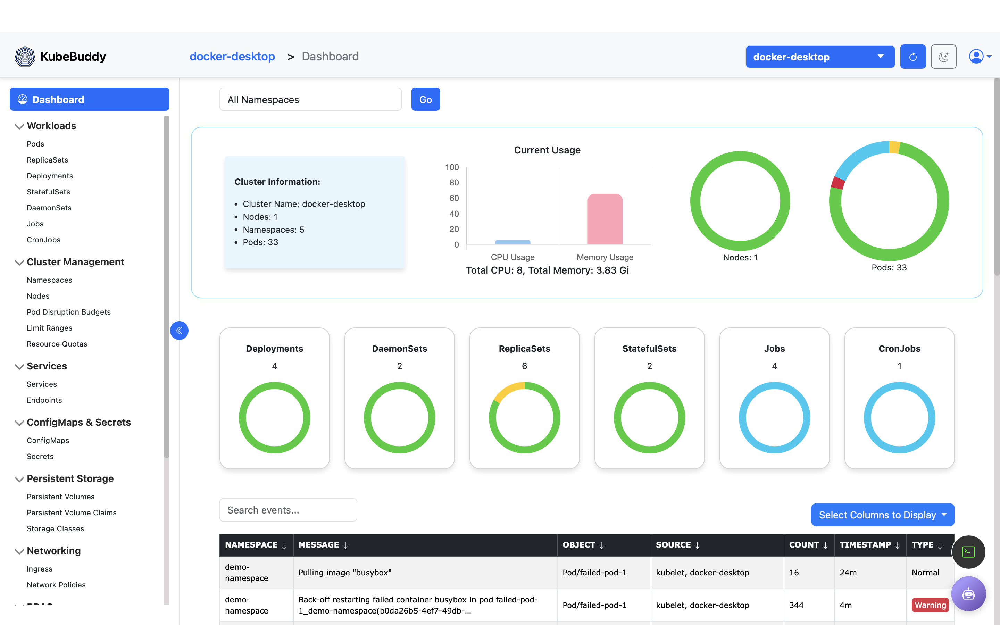

# Introduction

KubeBuddy is an AI-powered Kubernetes dashboard designed for simplified user experience to streamline your Kubernetes management. Built by Thinknyx Technologies LLP, KubeBuddy focuses on simplicity and accessibility while empowering teams with advanced AI capabilities. Focused on simplicity, accessibility, and intelligent insights,KubeBuddy dashboard eliminates the need for additional installations inside the cluster, providing a clean, intuitive UI that anyone can navigate with ease. But simplicity is just the beginning, KubeBuddy leverages the power of AI to provide quick error checks and suggestions. In its first release, KubeBuddy integrates seamlessly with cutting-edge AI platforms like Gemini and OpenAI to accelerate troubleshooting and decision-making. Check out the video below to learn more about KubeBuddy.

## Why KubeBuddy?

- KubeBuddy simplifies Kubernetes management with a streamlined, user-friendly interface.
- **Cluster Insights** - View events, logs, and cluster status.
- Discover how AI integrations can improve efficiency by offering real-time error diagnostics and suggestions.
- Understand how KubeBuddy’s no-installation approach on Kubernetes cluster makes it easy to deploy as a web app anywhere without burdening your Kubernetes cluster.

## Getting Started

Jump to the [Installation](#installation) section to set up KubeBuddy on your system.

<a href="#installation">
  <button class="btn btn-primary btn-sm">Next: Installation >> </button>
</a>
