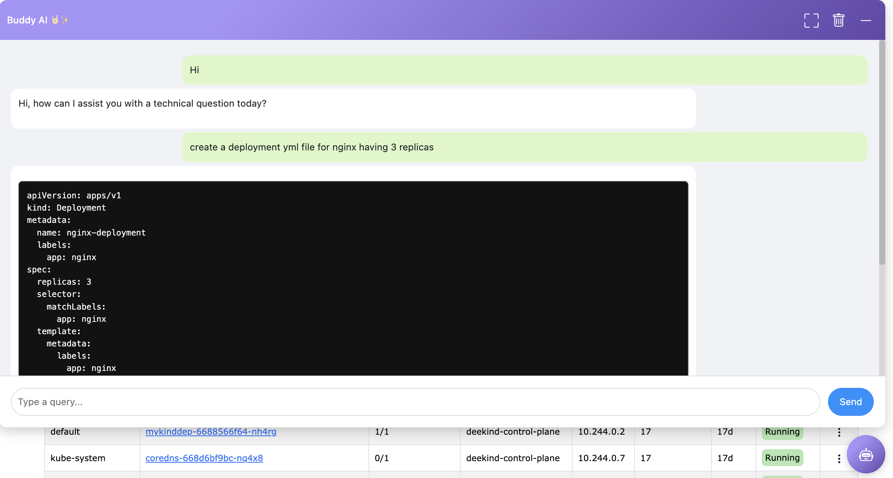

# kube-bench report

## What is a kube-bench report?

**kube-bench** is a tool that checks whether Kubernetes is deployed securely by running the checks documented in the CIS Kubernetes Benchmark.

## How to Access Buddy AI?

Buddy AI is available at the **bottom-right corner** of the application. Simply click the bot icon to open the chat window.

## What Can Buddy AI Do?

- Answer technical queries related to the application.
- Help troubleshoot errors and provide solutions.
- Guide users through common workflows within the application.

> **Note:** 
>- Buddy AI is designed for technical assistance only and does not handle general inquiries.
>- Buddy AI utilizes third-party LLMs such as Gemini and ChatGPT using their APIs. Please ensure that no sensitive data is provided to these models. This is to protect user privacy, maintain data security, and comply with data protection regulations.

<a href="#terminal">
  <button class="btn btn-secondary btn-sm"> << Previous: Terminal </button>
</a>