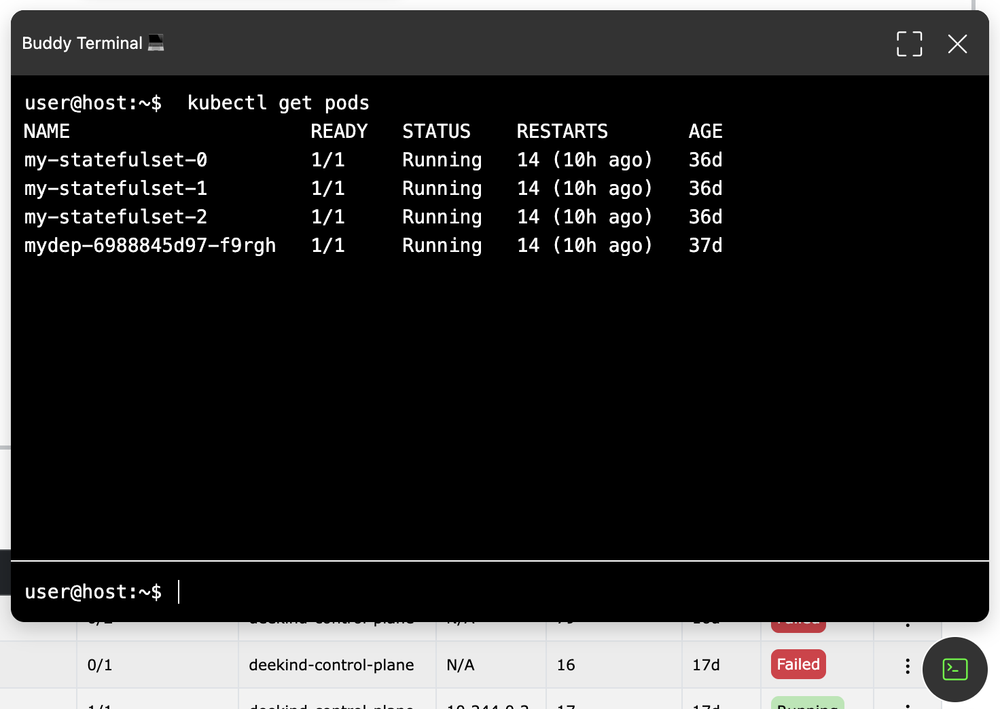

# Terminal

## Overview
The application provides an integrated **Terminal** that allows users to interact with the host machine where the application is running. This enables users to execute commands without leaving the application.

## How to Access the Terminal?
The terminal can be accessed from within the application interface via a button present in the **bottom right corner** of the browser window. It provides a command-line interface to execute supported commands directly from the browser.

## Usage Restrictions
- The terminal is restricted to the **application directory**.
- Users **cannot edit files** from the terminal.

> ⚠ **Important:** While you can execute commands, the terminal is restricted to the application directory and does not allow modifying files.

<a href="#buddy-ai">
  <button class="btn btn-secondary btn-sm"> << Previous: Buddy AI </button>
</a>

<a href="#k8sgpt">
  <button class="btn btn-primary btn-sm">Next: K8sGPT >> </button>
</a>